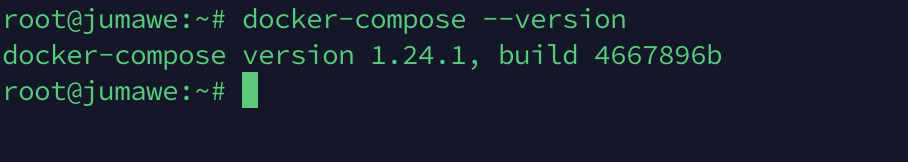

# nuxt-docker-digitalocean

1. First create a droplet on  [digitalocean](digitalocean.com)

Then install [Docker](https://docs.docker.com/install/#supported-platforms) and [Docker-Compose](https://docs.docker.com/compose/install/#install-compose) in the created droplet and your local machine (follow the instructions in the documentation for your operating system)

    Install docker in the server(droplet):
    >`sudo apt-get update`

    Next, it’s recommended to uninstall any old Docker software before proceeding.
    Use the command:
    >`sudo apt-get remove docker docker-engine docker.io`

    To install Docker on Ubuntu, in the terminal window enter the command:
    >`sudo apt install docker.io`

    Start and Automate Docker
    The Docker service needs to be setup to run at startup. To do so, type in each command followed by enter:
    >`sudo systemctl start docker`

    >`sudo systemctl enable docker`

    To verify the installed Docker version number, enter:
    >`docker --version`
    

    Install Docker-Compose
    Run this command to download the current stable release of Docker Compose:
    >`sudo curl -L "https://github.com/docker/compose/releases/download/1.24.1/docker-compose-$(uname -s)-$(uname -m)" -o /usr/local/bin/docker-compose`

    Apply executable permissions to the binary:

    >`sudo chmod +x /usr/local/bin/docker-compose`

    Test the installation.
    >`docker-compose --version`
    

   Create directory on your server for your project 
   >`cd ~ `
   
   >`mkdir website`

1. Create on your locale machine directory for example, let's call    the directory "website" and move your nuxtjs project(let's call it app) to this directory. 
    ## Dockerfile
    In our app folder, create a file and name it `Dockerfile`
    >This a text document that contains all the commands a user could call on the command line to assemble an image. And it has no extension.

      
      >`Dockerfile`

      >FROM node:10.7\
    ENV APP_ROOT /src\
    \
    RUN mkdir ${APP_ROOT}\
    WORKDIR ${APP_ROOT}\
    ADD . ${APP_ROOT}\
    \
    RUN npm install\
    RUN npm run build\
    \
    ENV HOST 0.0.0.0

      Understanding our Dockerfile
      * In this file we specify the node version we want our container to run. That's entirely up to you. latest is also a valid tag.
    * It is also specified the app root directory and then the commands we run to build our app.
    * The host is set to 0.0.0.0 to give full external access to the app container.
    
    ## Docker Compose
    Our compose file is located in our root website folder:
    
    Let's take a look to our docker-compose.yml
    
    >version: "3"\
      \
      services:\
        nuxt:\
          build: ./app/\
          container_name: news-website\
          restart: always\
          ports:\
            - "3333:3333"\
          command:\
            "npm run start"\
          \
        nginx:\
          image: nginx:1.13\
          container_name: news-nginx\
          ports:\
            - "80:80"\
          volumes:\
            - ./nginx:/etc/nginx/conf.d\
          depends_on:\
            - nuxt
  
    Understanding our docker-compose file:
  * Version: We are using the latest compose version which is 3
  * Services: Specify the set of services our app is composed of. In this case: nuxt.
    * Build: These are configuration options that are applied at build time. Can be specified either as a string containing a path to the build context, or an object with the path specified under context and optionally dockerfile and args.
    * Container_name: Your container's name.
    * Restart: Restart policy to apply when a container exits (default "no").
    * Ports: Expose ports. Either specify both ports (HOST:CONTAINER), or just the container port (a random host port will be chosen).
    * Command: After we specified in our Dockerfile the install and build commands, then we pass the start command to run our app.
  * Nginx: Another service we use, in this case it will be our server.
    * Image: Tag or partial image ID. Can be local or remote - Compose will attempt to pull if it doesn't exist locally. In this case we specified our nginx version. The tag :latest works as well.
    * (Skipping repeated concepts, and going straight to..)Volumes: Specifies the volumes to be created as part of your app. This is what we will use our nginx folder for, to inject our nginx config to the container.
    * Depends_on: Specifies the volumes to be created as part of your app. In this case our nginx is tied to our nuxt app.

  ## Configuring nginx
  We are almost ready. Our last step is to configure our nginx. By default, our app will be running on port 3000, we will use nginx as a reverse proxy.
  
  Create `nginx` folder and create the file: `default.conf` with the following contents:
  

      server {
        listen 80;
        server_name localhost;

        location / {
            proxy_pass http://news-website:3000;
            proxy_set_header Host $host;
            proxy_set_header X-Forwarded-For $proxy_add_x_forwarded_for;
        }
    }

# Running your app
Commit and clone your repo in your server. (The following instruction applies if you're running from your own computer)
locale to server (if use MacOS): `scp -r /Users/YOR_YOUR_NAME/PATH_TO_YOUR_PROJECT/website/* root@IP_YOUR_SERVER:~/website/`
* cd to the website folder
* Run `docker-compose up --build -d` and that's it!. The first time you run it, all the necessary files will be pulled from the docker repositories so it might take some time depending on your connection.

If you want to check everything went alright, run `docker ps` and you should see something like this:

to stop the docker process run `docker-compose stop` 
>Stops running containers without removing them. They can be started again with `docker-compose start`

or
>`docker-compose down` Stops containers and removes containers, networks, volumes, and images created by up.

More thanks! [Super Diana](https://github.com/alphacentauri82')
